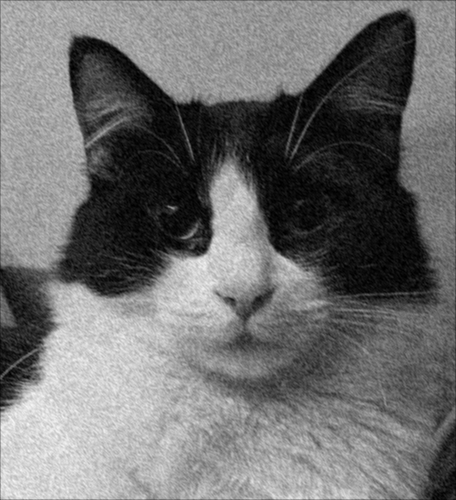
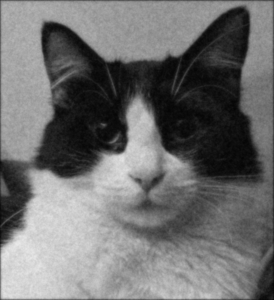
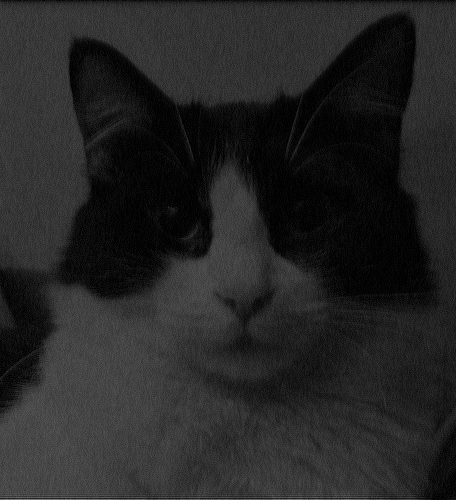

# NLA_CPP

This repository contains the code written by **Giulia Cavoletti**, **Francesco Paladini**, and **Paolo Potì** for the *Numerical Linear Algebra* course challenges at the **Politecnico di Milano**.

---

## Challenge 1: Image Filtering and Linear System Approximation

The goal of the first challenge is to:
- Apply image filters.
- Find the approximate solution of a linear system to process a greyscale image.

---

## Usage

Move to the `src` directory and compile `chal1_main.cpp` with:

```bash
g++ -I ${mkEigenInc} -I external/ chal.cpp utils.cpp -o chal1
```

Then execute the program with

```bash
./chal1 ../images/uma.jpg
```

---

## Results
To complete the challenge we used the Eigen and LIS libraries to apply image filters and to solve linear systems.
By writing the convolution operations corresponding to the kernels as a matrix–vector product, we obtained different effects on images.  
We started with the original one and then added noise:


<table align="center" style="border: none; margin: auto; border-collapse: collapse;">
  <tr>
    <td align="center">
      <br>
      <em>Original Image</em>
    </td>
    <td align="center">
      <br>
      <em>Noisy Image</em>
    </td>
  </tr>
</table>

We applied a smoothing kernel to the noisy image and a sharpening kernel to the original one:

$$
H_{av1} = \frac{1}{8} \begin{pmatrix}
1 & 1 & 0 \\
1 & 2 & 1 \\
0 & 1 & 1
\end{pmatrix}
\qquad
H_{sh1} = \begin{pmatrix}
0 & -2 & 0 \\
-2 & 9 & -2 \\
0 & -2 & 1
\end{pmatrix}
$$

We obtained the following images

<table align="center" style="border: none; margin: auto; border-collapse: collapse;">
  <tr>
    <td align="center">
      <br>
      <em>Blurred Image</em>
    </td>
    <td align="center">
      <br>
      <em>Sharpened Image</em>
    </td>
  </tr>
</table>

Using the LIS library we also solved the linear system $A_2\mathbf{x}=\mathbf{w}$ where $A_2$ is the matrix that corresponds to $H_{sh1}$ and $\mathbf{w}$ is the noisy image represented as a vector. Since $A_2$ is SPD we used the Conjugate Gradient method. We exported $\mathbf{x}$ as .png:

<p align="center">
  <br>
    <em>Solution of the linear system</em>
</p>

We constructed a matrix $A_3$ that corresponded to the detection filter

$$
H_{ed2} = \begin{pmatrix}
-1 & -2 & -1 \\
0 & 0 & 0 \\
1 & 2 & 1
\end{pmatrix}
$$

and by applying it to the original image we obtained:

<p align="center">
  <br>
    <em>Image after edge detection</em>
</p>

Finally we used Eigen to compute the approximate solution to the linear system $(3I + A_3)\mathbf{y} = \mathbf{w}$, where $A_3$ is the matrix that corresponds to $H_{ed2}$:

<p align="center">
  <br>
    <em>Solution of the linear system</em>
</p>
